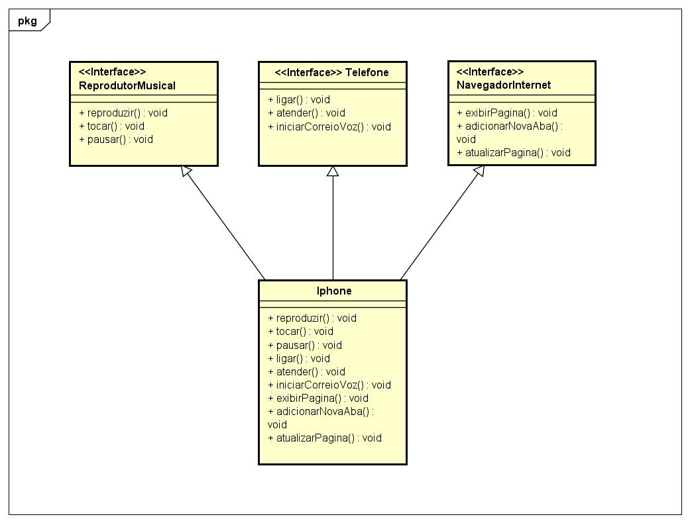

# DIO_Diagramacao-Classes-IPhone

## 
Projeto desenvolvido durante o Bootcamp e Formação JAVA da DIO (www.dio.me) com o Instrutor [Gleyson Sampaio](https://github.com/glysns) para colocar em prática toda a concepção de análise de negócios, requisitos, conceitos da programação orientada a objetos e modelagem UML. 

Foi elaborado o diagrama de classes e interfaces com a ferramenta de UML Astah de acordo vídeo de lançamento do iPhone, e as classes e interfaces desenvolvidas no formato de arquivos .java

## Diagrama UML

  

